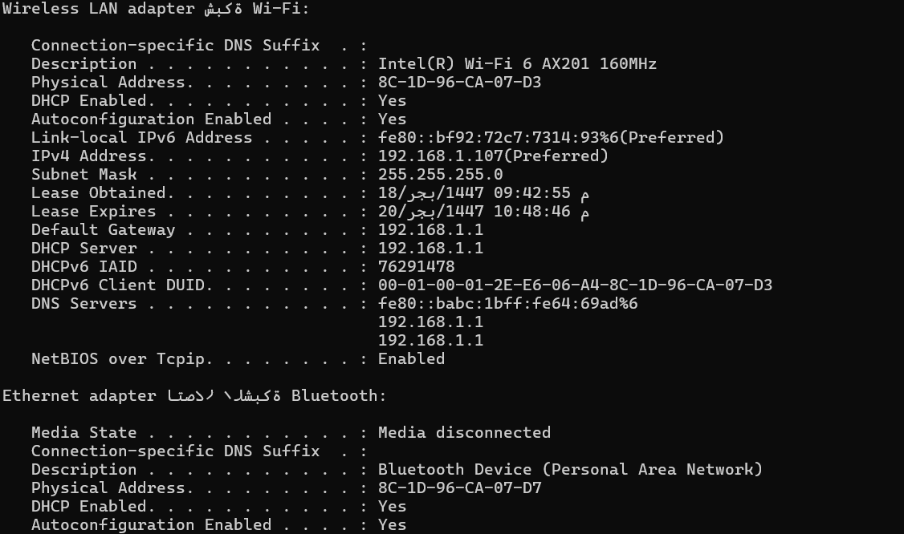
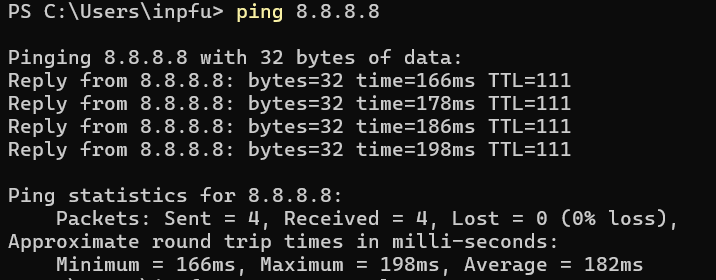

# Network Connectivity & Performance Diagnostics

##  Project Overview
This project documents a practical analysis of network performance and connectivity issues within a Small Office/Home Office (SOHO) environment. 

Using standard Windows Command Line Interface (CLI) tools, I diagnosed latency issues, analyzed routing paths, and provided optimization recommendations for a 4G/LTE-based network infrastructure.

##  Tools & Technologies
* **Operating System:** Windows 10/11
* **CLI Tools:** `ping`, `tracert` (Trace Route)
* **Concepts:** TCP/IP, DNS Resolution, Latency Analysis, ICMP, Signal-to-Noise Ratio (SINR).

##  Methodology & Tests
I conducted a three-step verification process to isolate the root cause of network latency:

1.  **Local Loopback & Gateway Test:** Verifying local hardware stack and router connectivity.
2.  **Internet Connectivity Test:** Measuring latency to external Public DNS (8.8.8.8) to evaluate ISP performance.
3.  **Path Analysis:** Using `tracert` to identify hops and potential bottlenecks outside the local network.

##  Key Findings
* **Local Network:** Stable with minimal latency (<5ms).
* **External Network:** High latency observed (Avg: 182ms).
* **Root Cause Analysis:** The high latency is inherent to the **4G/LTE wireless connection** limitations and signal interference, rather than local configuration errors.

##  Recommendations
Based on the analysis, I proposed the following optimization plan:
1.  **Physical Layer:** Relocate the 4G Router to improve the **Signal-to-Noise Ratio (SINR)** and reduce packet loss.
2.  **DNS Optimization:** Switch from ISP default DNS to **Google Public DNS (8.8.8.8)**. 
    * *Note:* While this improves domain resolution speed for browsing, I clarified that it does not reduce physical ICMP latency (Ping), demonstrating a clear understanding of networking layers.

##  Screenshots

.png)
