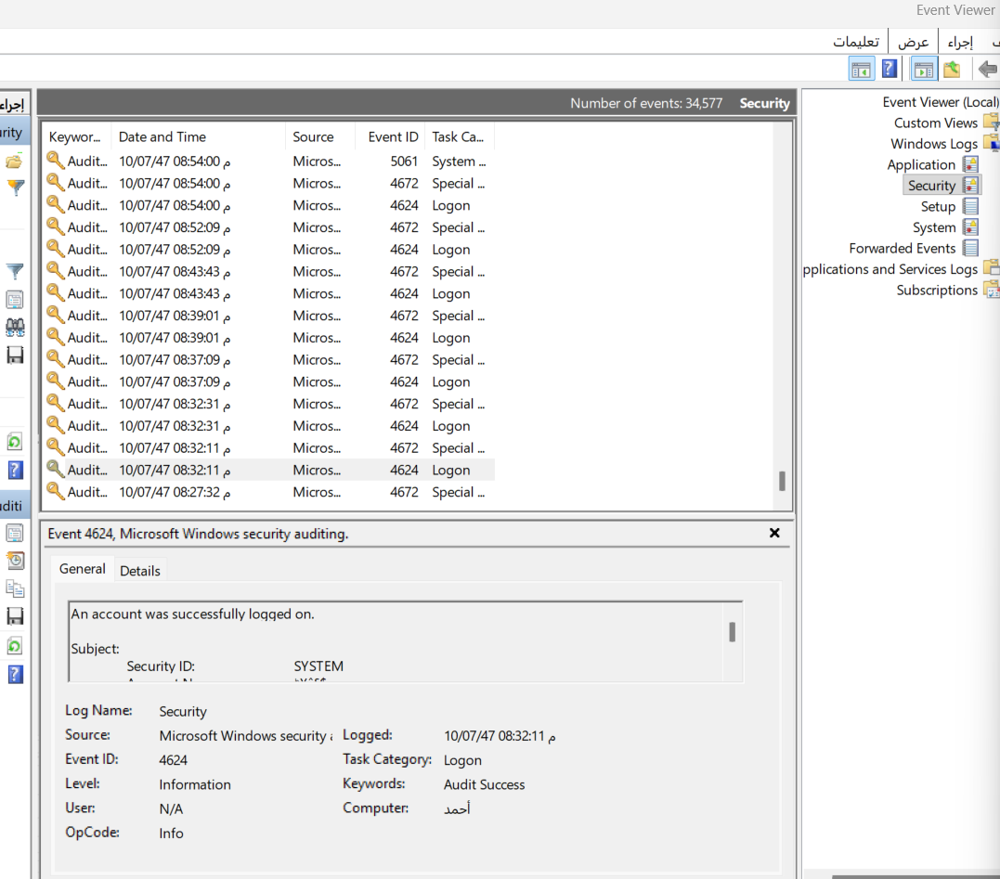
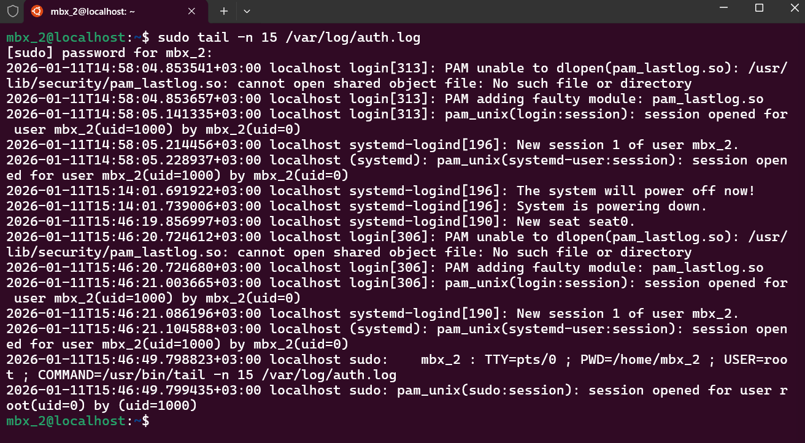

# IT Security Auditing & Event Monitoring

##  Project Overview
Monitoring system logs is a critical practice for identifying security breaches and unauthorized access. In this project, I demonstrated the ability to audit security events in both **Windows** and **Linux** environments to ensure system integrity.

## 🛠 Skills Demonstrated
* **Security Event Analysis:** Identifying successful and failed logon attempts.
* **Log Management:** Utilizing system tools to filter and read authentication logs.
* **Incident Detection:** Understanding system audit codes (e.g., Event ID 4624) to track user activity.

##  Implementation Details

### 1. Windows Security Auditing (Event Viewer)
I utilized the **Windows Event Viewer** to monitor the `Security` logs. I specifically tracked **Event ID 4624**, which signifies a successful logon.

**Key Findings:**
* Source: Microsoft Windows security auditing.
* Event ID: 4624 (Logon).
* Status: Audit Success.



---

### 2. Linux Authentication Logs (auth.log)
On the Linux side (Ubuntu), I audited the `/var/log/auth.log` file to monitor user authentication and `sudo` command usage.

**Command Executed:**
```bash
sudo tail -n 15 /var/log/auth.log

**Key Findings:**
The logs confirm session openings for the user and successful privilege escalation via sudo, providing a clear trail of administrative actions.
```

