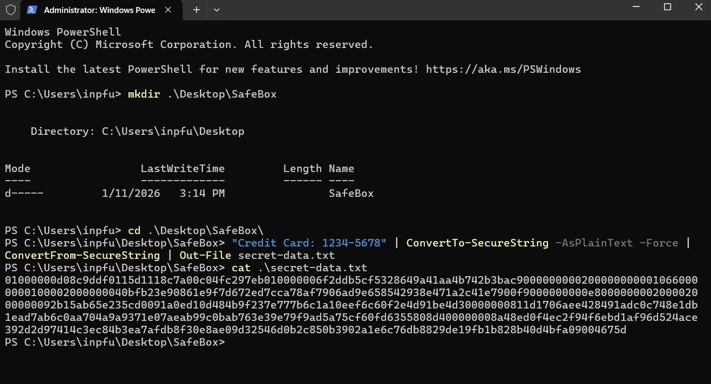
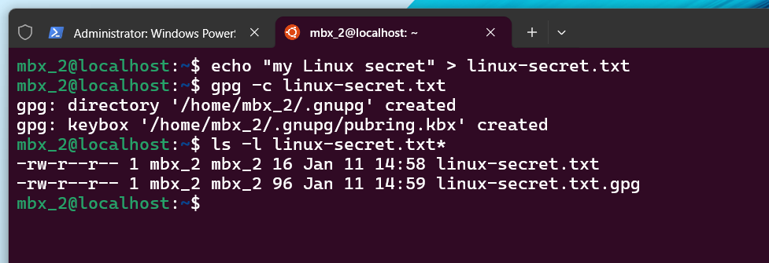

# Data Encryption & Secure Communications

##  Project Overview
The objective of this project is to implement **Data Confidentiality** using encryption techniques. I demonstrated how to protect sensitive information across different platforms, even when facing system-specific limitations.

## 🛠 Skills Demonstrated
* **Symmetric Encryption:** Using GPG for file-level protection in Linux.
* **Cryptographic Scripting:** Using PowerShell to transform plain text into encrypted secure strings.
* **Problem Solving:** Identifying OS limitations (Windows Home Edition) and implementing programmatic workarounds to achieve security goals.

##  Implementation Details

### 1. Windows Environment (PowerShell Scripting)
Since the standard `cipher` command (EFS) is restricted in Windows Home Edition, I utilized PowerShell's cryptographic cmdlets to encrypt sensitive data within a file.

**Workflow:**
```powershell
# Encrypt plain text and save it to a file
"Credit Card: 1234-5678" | ConvertTo-SecureString -AsPlainText -Force | ConvertFrom-SecureString | Out-File secret-data.txt

# Verify content (displays encrypted string)
cat secret-data.txt

**Verification:**
The screenshot confirms that the plain text data is successfully transformed into a long cryptographic string, making it unreadable to unauthorized users.
```



---

### 2. Linux Environment (GPG Encryption)
In the Linux environment, I used **GnuPG (GPG)**, the industry standard for symmetric encryption, to secure a sensitive file.

**Workflow:**
```bash
# Encrypt the file using a passphrase
gpg -c linux-secret.txt

# List files to verify the creation of the .gpg encrypted file
ls -l linux-secret.txt*

**Verification:**
The output shows the creation of linux-secret.txt.gpg. This file is now a secure container that requires the correct passphrase for access.
```

