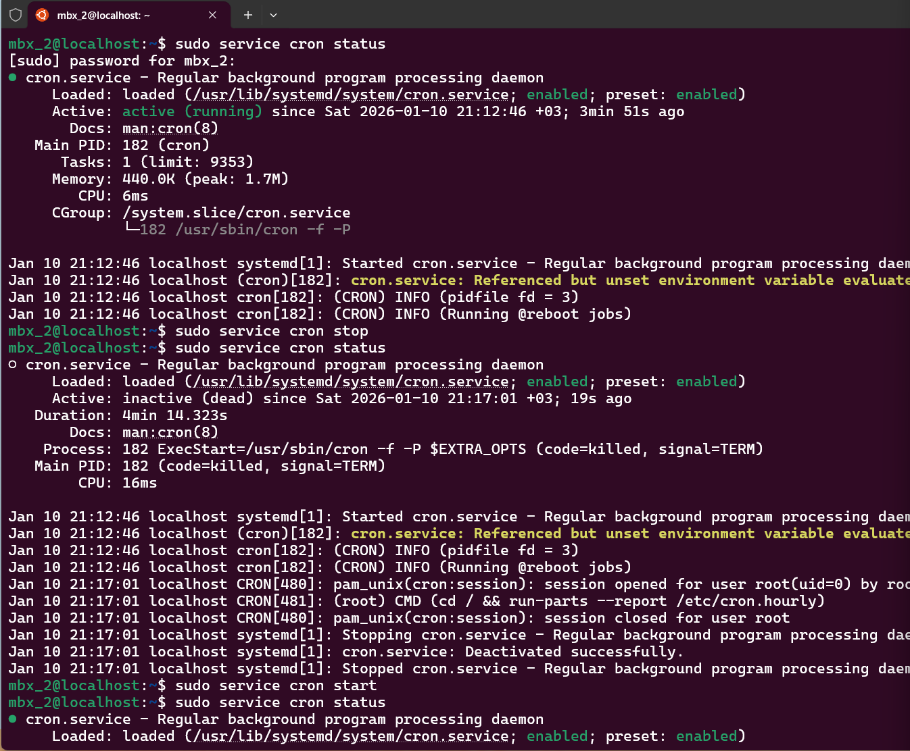

# Service Lifecycle Management (Infrastructure Support)

##  Project Overview
This project demonstrates the ability to manage critical system services in both **Windows** and **Linux**. Understanding how to start, stop, and verify services is a fundamental skill for any System Administrator to troubleshoot application failures and maintain system stability.

## Skills Demonstrated
* **Service Monitoring:** Checking the real-time status of system daemons and services.
* **Control Operations:** Safely stopping and starting services via CLI.
* **Infrastructure Troubleshooting:** Simulating a service reset to resolve potential application hangs.

##  Implementation Details

### 1. Windows Environment (PowerShell)
I managed the **Print Spooler** service, which is a critical component for printing operations.

```powershell
# Check current status
Get-Service Spooler

# Stop the service to simulate maintenance
Stop-Service Spooler

# Restart the service to restore functionality
Start-Service Spooler

**Verification:**
The screenshot below shows the service status transitioning from `Running` to `Stopped` and back to `Running`.
```


---

### 2. Linux Environment (Ubuntu via WSL)
I managed the **Cron** daemon, which is the standard Linux service for scheduling background tasks.

**Commands Executed:**
```bash
# 1. Check if the daemon is active
sudo service cron status

# 2. Stop the daemon
sudo service cron stop

# 3. Start the daemon again
sudo service cron start

**Verification:**
The sequence in the screenshot confirms successful control over the `cron` service states, showing it transitioning from active to inactive and back to active.
```

